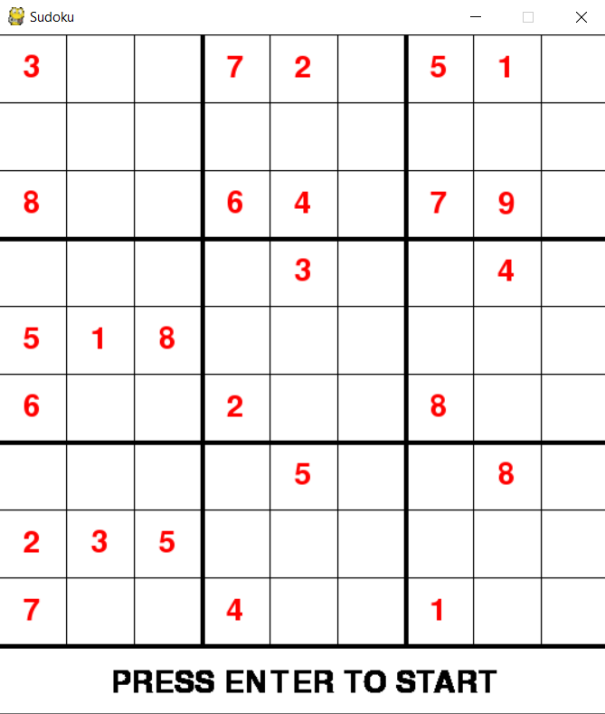
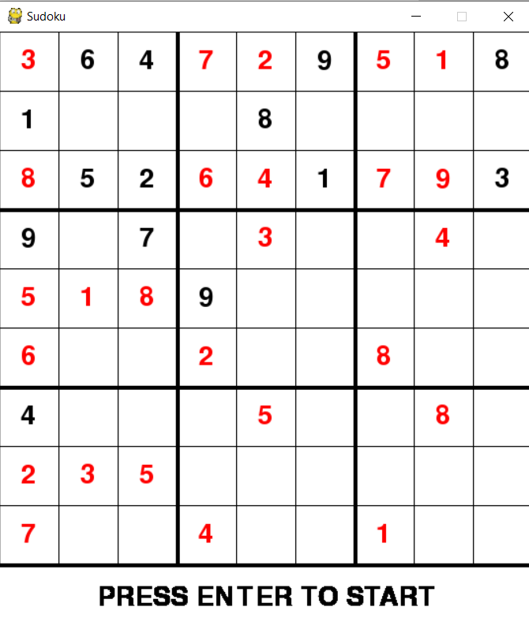
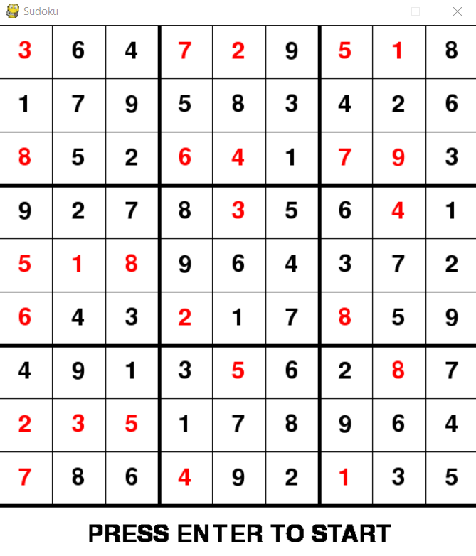

# Sudoku-Solver
Generates a sudoku board by randomly permuting an existing board which ensures the solvability
of the puzzle, then solves it using a backtracking algorithm.

The process is displayed through a pygame GUI that shows what the algorithm is currently thinking.

**Starting point:**

**While the solving is on-going:**

**The end result:**

